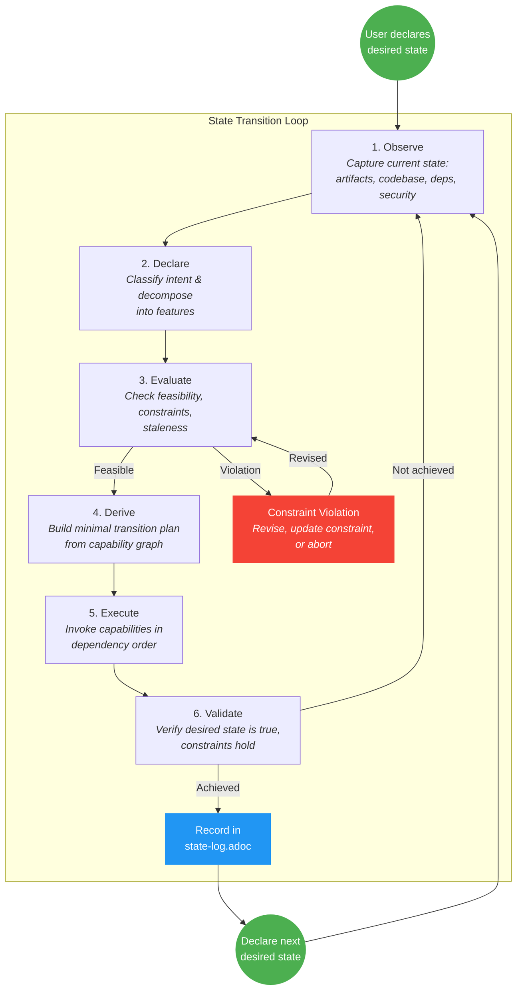
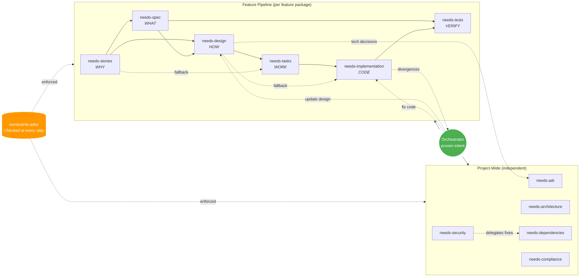
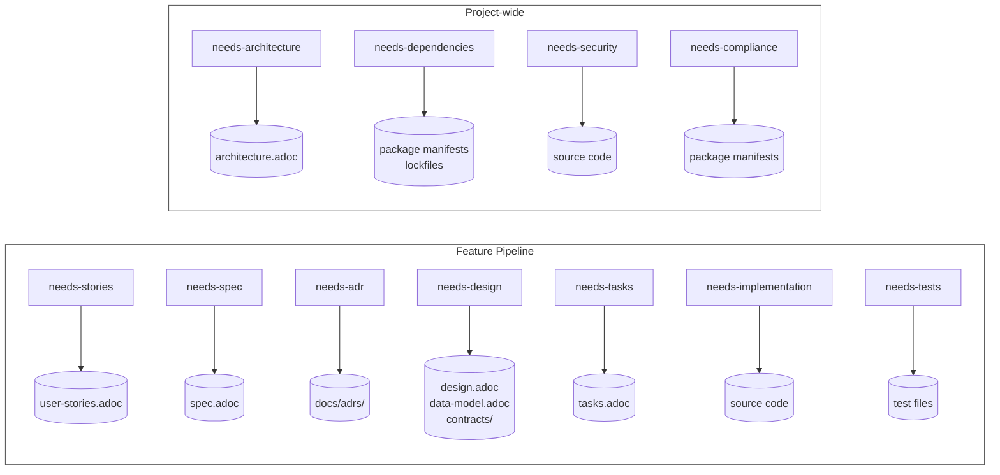
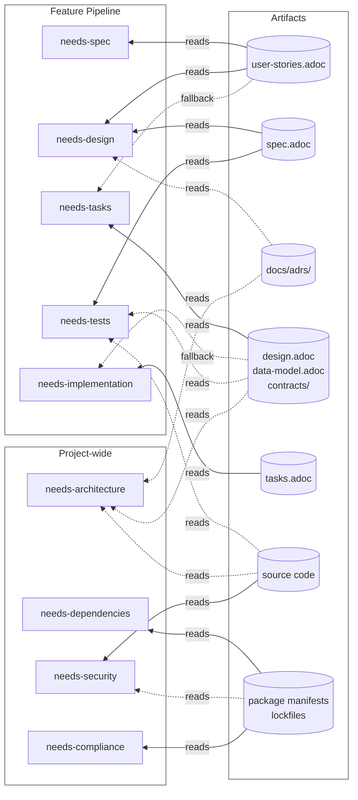
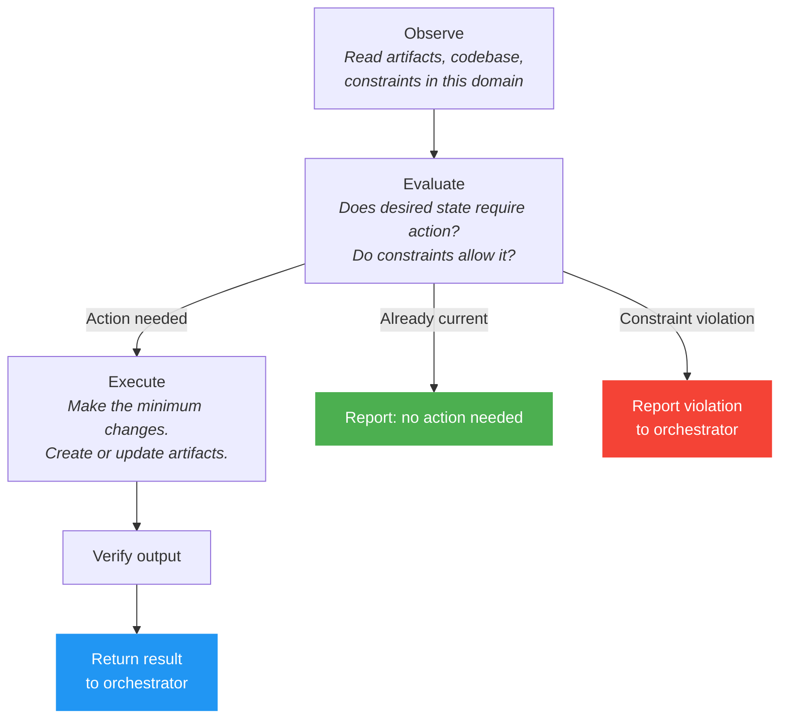
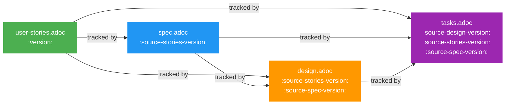

# proven-capability

Intent-driven state transition workflow for evolving software systems.

Declare a **desired state**, evaluate it against **reality** and **constraints**, then execute the **minimal valid transition** to make it true. Both feature work and maintenance use the same mechanism.

## How It Works



1. **Observe** current state (artifacts, codebase, dependencies, security posture)
2. **Declare** desired state ("Users can reset password via SMS", "No vulnerable dependencies")
3. **Evaluate** feasibility against constraints
4. **Derive** the minimal transition plan (which capabilities to invoke)
5. **Execute** the transition
6. **Validate** the desired state is now true

The system figures out what needs to happen. You declare what must be true.

### Capability Invocation

During the **Execute** phase, the orchestrator invokes capabilities in dependency order. The pipeline is not rigid -- the orchestrator derives what is needed dynamically and can skip steps whose artifacts are already current.



**Key relationships:**
- **Solid arrows** = primary dependency (required upstream artifact)
- **Dotted arrows** = optional or fallback paths
- `needs-spec` is always generated -- every feature gets a specification
- `needs-design` requires both stories and spec
- `needs-tasks` prefers design but can derive tasks directly from stories
- `needs-implementation` prefers tasks but can work story-by-story from design alone
- `needs-tests` derives test cases from specs and runs them against the implementation
- `needs-design` can trigger `needs-adr` creation for technology decisions (lateral invocation)
- `needs-security` delegates dependency vulnerability fixes to `needs-dependencies`
- After implementation, divergences between design and code are reported to the orchestrator. The user decides per-divergence whether to update the design or fix the code.

Independent features can be processed concurrently.

### Artifact Traceability

Each capability reads upstream artifacts and writes its own. The two diagrams below separate ownership (writes) from dependencies (reads) for clarity.

#### Artifact Ownership (writes)

Each capability owns and produces specific artifacts. `state-log.adoc` is managed by the orchestrator.



#### Artifact Dependencies (reads)

Solid lines are primary inputs; dashed lines are fallback or optional inputs. All capabilities also read `constraints.adoc` during their Evaluate phase (omitted for clarity).



| Capability | Reads | Writes |
|---|---|---|
| `needs-stories` | `constraints.adoc` | `user-stories.adoc` |
| `needs-spec` | `user-stories.adoc`, `constraints.adoc` | `spec.adoc` |
| `needs-design` | `user-stories.adoc`, `spec.adoc`, ADRs, `constraints.adoc`, `architecture.adoc` | `design.adoc`, `data-model.adoc`, `contracts/` |
| `needs-tasks` | `design.adoc` (or `user-stories.adoc` as fallback), `spec.adoc`, `constraints.adoc` | `tasks.adoc` |
| `needs-implementation` | `tasks.adoc` (or `design.adoc` as fallback), `user-stories.adoc`, `spec.adoc`, `constraints.adoc`, ADRs | source code |
| `needs-tests` | `spec.adoc`, `design.adoc`, `user-stories.adoc`, `constraints.adoc`, source code | test files |
| `needs-adr` | existing ADRs | `docs/adrs/*.adoc`, `index.adoc` |
| `needs-architecture` | all feature designs, ADRs, `constraints.adoc`, codebase | `docs/architecture.adoc` |
| `needs-dependencies` | package manifests, `constraints.adoc` | package manifests, lockfiles |
| `needs-security` | codebase, dependencies, config, `constraints.adoc` | source code, config |
| `needs-compliance` | dependencies, `constraints.adoc` | dependencies, `constraints.adoc` |

## Entry Point

Load the `proven-intent` skill. It is the single orchestrator that accepts intents, classifies them, and invokes the appropriate capabilities.

```
I want users to be able to browse products, add them to cart, and checkout
```

The orchestrator will:
1. Decompose this into feature packages (product-browsing, shopping-cart, checkout)
2. Ask you to confirm the grouping
3. For each feature: create stories, derive specs, design, plan tasks, implement, generate tests
4. Resolve any design divergences (user decides: update design or fix code)
5. Record technology decisions as ADRs along the way
6. Update the architecture document when all features are implemented

## Core Concepts

### Desired State
A declarative statement of what must be true. Not a task list -- an intent.

- "Users can reset their password via SMS" (feature)
- "No dependencies have known vulnerabilities" (maintenance)
- "All API endpoints enforce rate limiting" (constraint)

### Constraints
Project-wide invariants that must not be violated. Defined in `constraints.adoc`:

- License compliance rules
- Security policies
- Architecture boundaries
- Quality standards
- Performance SLAs

Cross-cutting requirements belong here, not in feature specs.

### Feature Packages
Self-contained units of work at `docs/features/<slug>/`:

```
docs/features/shopping-cart/
├── user-stories.adoc    # WHY: user needs
├── spec.adoc            # WHAT: testable requirements
├── design.adoc          # HOW: implementation blueprint
└── tasks.adoc           # WORK: phased task breakdown
```

Each feature is fully independent -- it can be specified, designed, and implemented without reading other features.

Features can be **archived** when superseded or no longer relevant. Archived features remain on disk as historical records but are skipped during intent classification.

### State Log
Append-only audit trail at `docs/state-log.adoc` recording every transition: what was intended, what changed, what was verified.

## Capabilities

### Feature-Scoped (operate within a feature package)

| Capability | Skill | What it does |
|---|---|---|
| Stories | `needs-stories` | Create user stories explaining WHY |
| Specifications | `needs-spec` | Derive black-box testable requirements (WHAT) |
| Design | `needs-design` | Create implementation blueprint (HOW) |
| Tasks | `needs-tasks` | Break design into phased coding units |
| Implementation | `needs-implementation` | Write and verify code |
| Tests | `needs-tests` | Derive and generate tests from specifications (VERIFY) |

### Project-Wide (operate at the project level)

| Capability | Skill | What it does |
|---|---|---|
| ADRs | `needs-adr` | Record technology decisions |
| Architecture | `needs-architecture` | Document current system architecture |
| Dependencies | `needs-dependencies` | Manage and update dependency graph |
| Security | `needs-security` | Assess and remediate security posture |
| Compliance | `needs-compliance` | Verify license and policy compliance |

### Supporting

| Skill | What it does |
|---|---|
| `ears-requirements` | EARS methodology reference for stories and specs |

Every capability follows the **observe/evaluate/execute** pattern:



1. **Observe** -- assess current state in this domain
2. **Evaluate** -- does the desired state require action? do constraints allow it?
3. **Execute** -- make the minimum changes

## Artifact Lifecycle

| Artifact | Location | Lifecycle |
|---|---|---|
| Constraints | `constraints.adoc` | Stable, changes rarely |
| User Stories | `docs/features/<slug>/user-stories.adoc` | Living, versioned per feature |
| Specifications | `docs/features/<slug>/spec.adoc` | Living, synced with stories |
| Design | `docs/features/<slug>/design.adoc` | Living, synced with stories and specs |
| Tasks | `docs/features/<slug>/tasks.adoc` | Ephemeral -- stale when design changes |
| Tests | `tests/features/<slug>/` | Living, synced with specs |
| ADRs | `docs/adrs/NNNN-title.adoc` | Permanent, append-only |
| Architecture | `docs/architecture.adoc` | Living, reflects current system |
| State Log | `docs/state-log.adoc` | Append-only audit trail |
| Code | project source | Living -- the actual system |

### Version Tracking and Staleness

Each downstream artifact tracks its upstream version. When an upstream artifact changes, downstream artifacts become stale and need syncing.



When stories change, specs become stale. When specs change, the design becomes stale. When the design changes, tasks become stale. The orchestrator detects these cascades during the Evaluate phase and includes sync steps in the transition plan.

## Risk Classification

Transitions are auto-approved or require confirmation based on risk:

| Risk | Auto-approve? | Examples |
|---|---|---|
| **Low** | Yes | Patch dependency updates, metadata fixes |
| **Medium** | Propose, ask | Minor dependency updates, spec syncs |
| **High** | Full plan, require approval | New features, architecture changes, code changes |

## EARS Requirements

Acceptance criteria and specifications use [EARS sentence types](skills/ears-requirements/references/ears-reference.adoc):

| Type | Pattern | Use for |
|------|---------|---------|
| Ubiquitous | The \<system\> shall \<response\>. | Always-on behavior |
| Event-driven | When \<trigger\>, the \<system\> shall \<response\>. | User actions or events |
| State-driven | While \<state\>, the \<system\> shall \<response\>. | Behavior during a state |
| Unwanted behavior | If \<trigger\>, then the \<system\> shall \<response\>. | Errors and edge cases |
| Optional | Where \<feature\>, the \<system\> shall \<response\>. | Feature-dependent behavior |

## Example

Given the intent: "I want an e-commerce site where users can browse products, add them to cart, and checkout"

The orchestrator produces:

```
docs/features/
├── product-browsing/
│   ├── user-stories.adoc   # 2 stories: View Catalog, Search
│   ├── spec.adoc            # PROD-001 through PROD-008
│   ├── design.adoc          # Frontend + API design
│   └── tasks.adoc           # 3 phases, 8 tasks
├── shopping-cart/
│   ├── user-stories.adoc   # 2 stories: Add to Cart, View Cart
│   ├── spec.adoc            # CART-001 through CART-008
│   ├── design.adoc          # CartService + UI design
│   └── tasks.adoc           # 3 phases, 9 tasks
└── checkout/
    ├── user-stories.adoc   # 1 story: Checkout Process
    ├── spec.adoc            # CHK-001 through CHK-006
    ├── design.adoc          # Payment flow design
    └── tasks.adoc           # 3 phases, 7 tasks

docs/adrs/
├── index.adoc
├── 0001-use-typescript.adoc
├── 0002-use-postgresql.adoc
└── 0003-use-stripe.adoc

docs/architecture.adoc
docs/state-log.adoc
constraints.adoc
```

## What This Is Not

- **Not waterfall** -- the desired state is disposable; declare a new one each iteration
- **Not backlog-driven** -- work is derived each iteration, not accumulated in a backlog
- **Not uncontrolled** -- constraints anchor behavior and prevent regressions

## Reference

- [EARS Quick Reference](skills/ears-requirements/references/ears-reference.adoc) -- Requirement syntax standard
- [Example Session](skills/proven-intent/references/example-session.adoc) -- Full walkthrough of feature and maintenance intents
