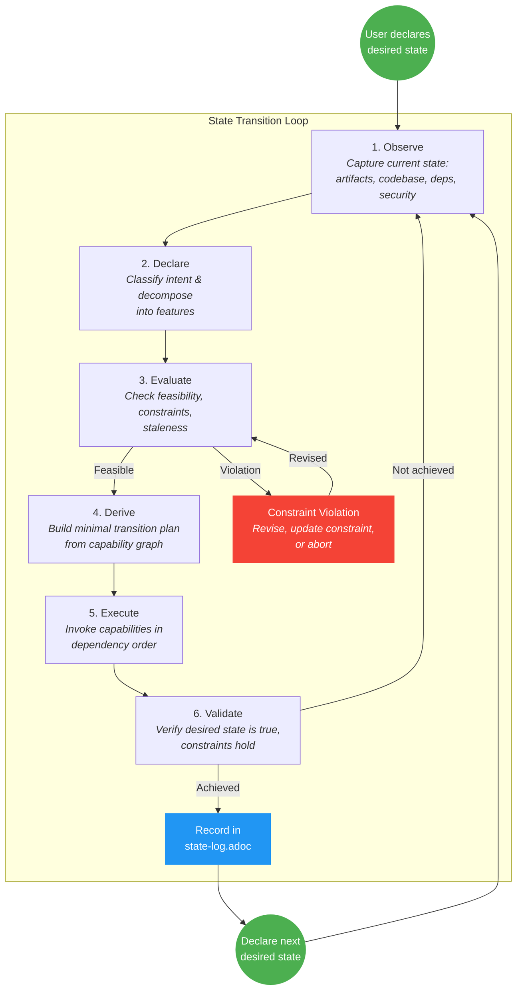
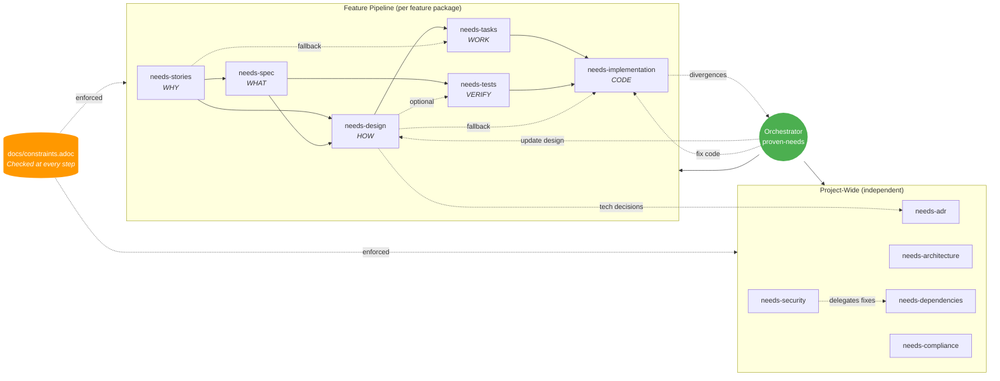
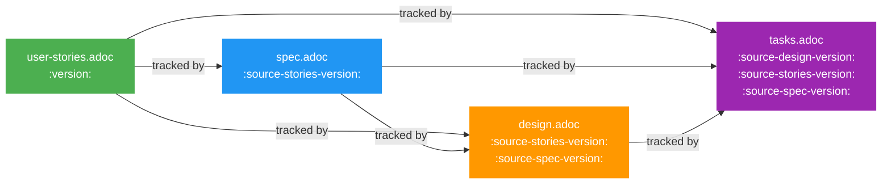
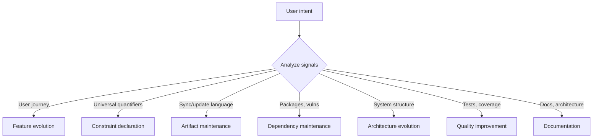
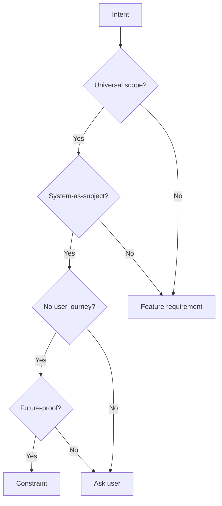
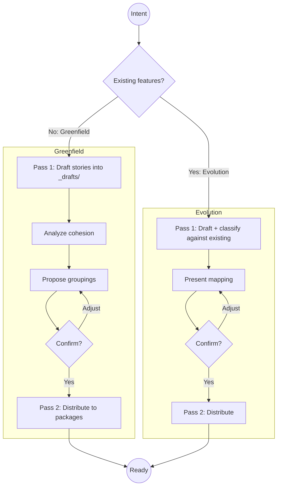
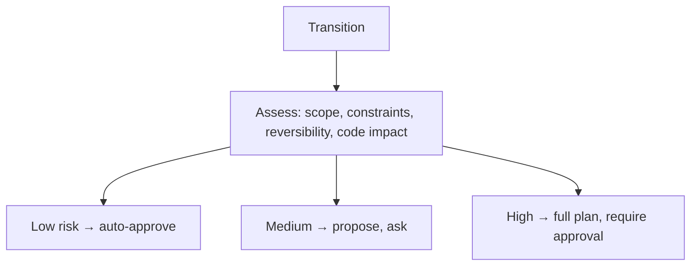
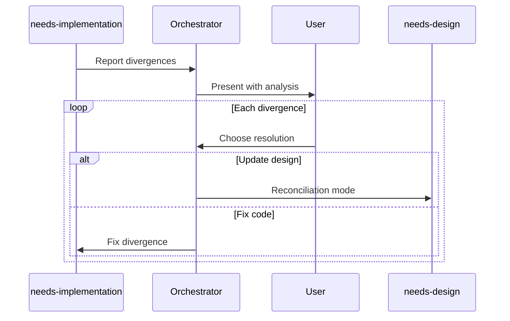
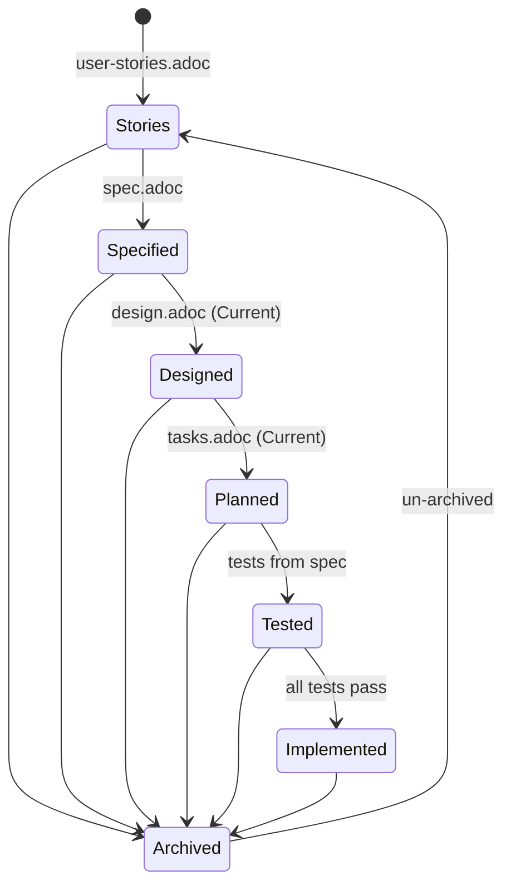

# proven-needs

Intent-driven state transition workflow for evolving software systems.

Declare a **desired state**, evaluate it against **reality** and **constraints**, then execute the **minimal valid transition** to make it true. Both feature work and maintenance use the same mechanism.

## How It Works



The system figures out what needs to happen. You declare what must be true.

## Entry Point

Load the `proven-needs` skill. It is the single orchestrator that accepts intents, classifies them, and invokes the appropriate capabilities.

```
I want users to be able to browse products, add them to cart, and checkout
```

The orchestrator will: decompose into features, confirm grouping, then for each feature create stories, derive specs, design, plan tasks, generate tests, implement -- resolving divergences and recording ADRs along the way.

## Capabilities



**Solid arrows** = required dependency. **Dotted** = optional/fallback.

| Scope | Capability | Skill | Domain |
|---|---|---|---|
| Feature | Stories | `needs-stories` | WHY: user needs |
| Feature | Specs | `needs-spec` | WHAT: black-box requirements |
| Feature | Design | `needs-design` | HOW: implementation blueprint |
| Feature | Tasks | `needs-tasks` | WORK: phased coding units |
| Feature | Tests | `needs-tests` | VERIFY: spec-derived test cases |
| Feature | Implementation | `needs-implementation` | CODE: working software |
| Project | ADRs | `needs-adr` | Technology decisions |
| Project | Architecture | `needs-architecture` | System structure (C4 model) |
| Project | Dependencies | `needs-dependencies` | Dependency management |
| Project | Security | `needs-security` | Security posture |
| Project | Compliance | `needs-compliance` | License/policy compliance |
| Support | EARS | `ears-requirements` | Requirement syntax reference |

Every capability follows **observe/evaluate/execute**: assess current state, check if action is needed and constraints allow it, make minimum changes.

## Artifact Traceability



Each downstream artifact tracks its upstream version. When an upstream changes, downstream artifacts become stale. The orchestrator detects cascades and includes sync steps in the transition plan.

| Capability | Reads | Writes |
|---|---|---|
| `needs-stories` | `docs/constraints.adoc` | `user-stories.adoc` |
| `needs-spec` | `user-stories.adoc`, `docs/constraints.adoc` | `spec.adoc` |
| `needs-design` | `user-stories.adoc`, `spec.adoc`, ADRs, `docs/constraints.adoc`, `architecture.adoc` | `design.adoc`, `data-model.adoc`, `contracts/` |
| `needs-tasks` | `design.adoc` (or `user-stories.adoc` fallback), `spec.adoc`, `docs/constraints.adoc` | `tasks.adoc` |
| `needs-implementation` | `tasks.adoc` (or `design.adoc` fallback), `user-stories.adoc`, `spec.adoc`, `docs/constraints.adoc`, ADRs | source code |
| `needs-tests` | `spec.adoc`, `design.adoc`, `user-stories.adoc`, `docs/constraints.adoc`, source code | test files |
| `needs-adr` | existing ADRs | `docs/adrs/*.adoc`, `index.adoc` |
| `needs-architecture` | all feature designs, ADRs, `docs/constraints.adoc`, codebase | `docs/architecture.adoc` |
| `needs-dependencies` | package manifests, `docs/constraints.adoc` | package manifests, lockfiles |
| `needs-security` | codebase, dependencies, config, `docs/constraints.adoc` | source code, config |
| `needs-compliance` | dependencies, `docs/constraints.adoc` | dependencies, `docs/constraints.adoc` |

## Visual Reference

### Intent Classification



### Constraint Detection



### Feature Decomposition (Two-Pass)



### Risk Classification



### Design Divergence Resolution



### Feature Status



## What This Is Not

- **Not waterfall** -- the desired state is disposable; declare a new one each iteration
- **Not backlog-driven** -- work is derived each iteration, not accumulated in a backlog
- **Not uncontrolled** -- constraints anchor behavior and prevent regressions

## Reference

- [EARS Quick Reference](skills/ears-requirements/references/ears-reference.adoc) -- Requirement syntax standard
- [Example Session](skills/proven-needs/references/example-session.adoc) -- Full walkthrough of feature and maintenance intents
