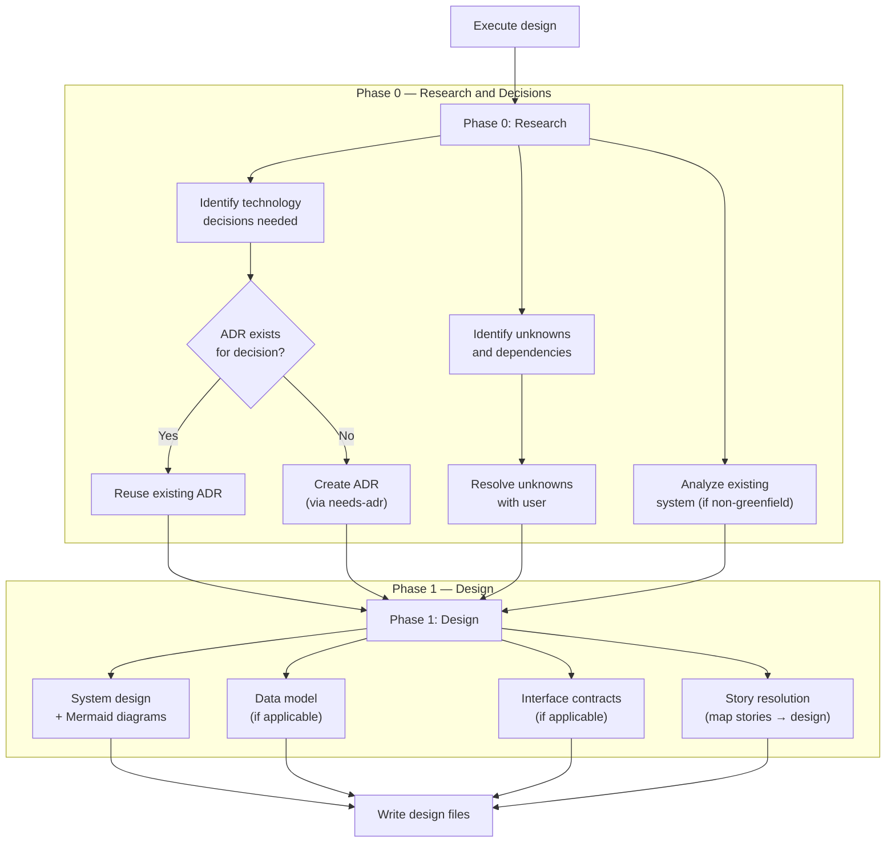
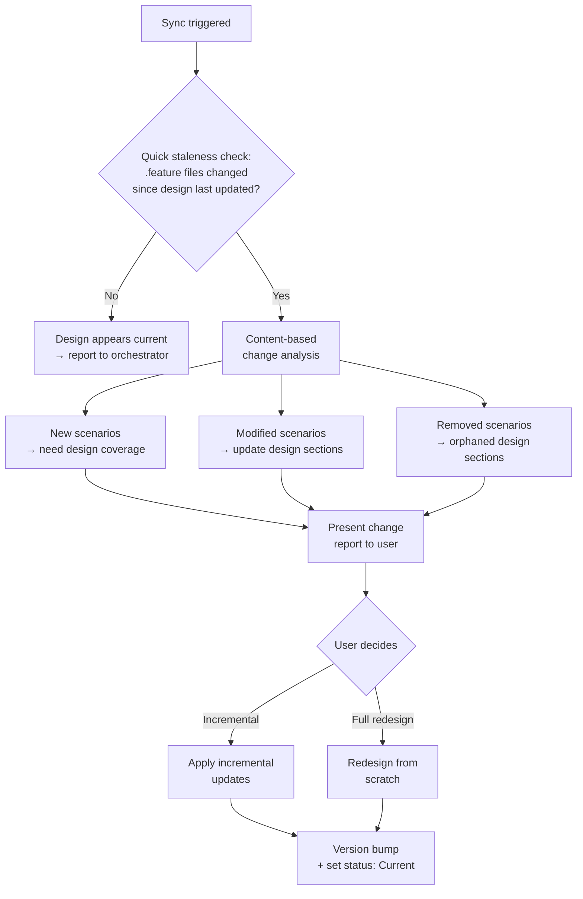

## Prerequisites

This skill is invoked by the `proven-needs` orchestrator, which provides the feature context (slug, intent, current state).

During Phase 0 (Research and Decisions), this skill loads the `needs-adr` skill directly when the user confirms that a technology decision should be recorded as an ADR. This is the one case where a capability skill loads another capability skill without routing through the orchestrator -- because the ADR creation is part of the design research phase, not a separate transition step.

## Observe

Assess the current state of the design for this feature.

### 1. Read feature files

Read all `docs/features/<slug>/*.feature` files. Extract:
- `Feature:` descriptions (the user story narratives: As a / I want / So that)
- All scenario names, tags (spec IDs like `@PROD-001`), and Given/When/Then steps
- Background sections (shared preconditions)
- Scenario Outlines with their Examples tables

**If missing:** Report to the orchestrator that feature files are missing. The orchestrator decides whether to invoke `needs-features` first.

### 3. Read project-wide artifacts

- **`docs/adrs/`** -- read all ADRs with status `Accepted`. These are technology constraints.
- **`docs/constraints.adoc`** -- read all constraints, particularly architecture and quality constraints.
- **`docs/architecture.adoc`** -- if it exists, understand the current system architecture for context.

### 4. Read existing design

If `docs/features/<slug>/design.adoc` exists:
- Read `:version:`, `:status:`, `:last-updated:`
- Read the full design content

### 5. Analyze codebase

If this is not a greenfield project, analyze the current code structure to understand what already exists. Look at directory structure, key source files, configuration files, and existing patterns.

### 6. Report observation

Return to the orchestrator:
```
Feature: <slug>
Feature files: {exists: true/false, count: N, scenarios: N, spec-ids: [...]}
Design: {exists: true/false, version: "X.Y.Z", status: "Current/Stale"}
ADRs: {count: N, accepted: N}
Constraints: {count: N, architecture: N, quality: N}
Codebase: {type: "TypeScript/Next.js", existing-patterns: [...]}
```

## Evaluate

Given the desired state from the orchestrator, determine what action is needed.

### 1. Does the desired state require design changes?

| Condition | Action |
|---|---|
| No design exists | Create new design |
| Design exists, `.feature` files unchanged since design last updated (via git) | Design appears current. Report to orchestrator. |
| Design exists, `.feature` files changed since design last updated | Design is stale. Sync with upstream changes (incremental update or full redesign). |

### 2. Check constraints

- Verify proposed design elements against architecture constraints
- Verify design decisions respect ADR decisions
- Flag any constraint conflicts

### 3. Report evaluation

Return to the orchestrator:
```
Action: create / sync / none
Constraint conflicts: [list or none]
Technology decisions needed: [list or none]
```

## Execute



### Phase 0: Research and Decisions

Analyze all Gherkin feature files to identify:

1. **Technology decisions needed** -- for each feature capability, what technology choices are required? Cross-reference against existing ADRs:
   - "Cart scenarios require persistent storage -- which database?" (if no ADR exists)
   - "Real-time update scenarios require push mechanism -- WebSocket or SSE?" (if no ADR exists)

2. **Unknowns and dependencies** -- external systems, third-party services, constraints needing clarification.

3. **Existing system analysis** (non-greenfield only) -- how is the current system structured? What patterns does it use? What can be reused vs. modified?

**For each technology decision not covered by an existing ADR:**
1. Present the decision to the user with context, alternatives considered, and a recommendation
2. Ask the user: "Should I create an ADR for this decision?"
3. **If yes:** Load the `needs-adr` skill and create the ADR before proceeding. The design document will reference the new ADR (e.g., `<<../../adrs/NNNN-decision-title.adoc#,ADR-NNNN>>`).
4. **If no:** Record the decision in the design's "Decisions and Constraints" section with a brief rationale, but note that it is an unrecorded decision (not an ADR).

**Do NOT skip this step.** Technology decisions made during design are the primary source of ADRs. If Phase 0 identifies decisions and the user agrees to create ADRs, the ADRs must be created before moving to Phase 1, so the design document can reference them.

**For each unknown:**
- Present it to the user as an open question
- Resolve before proceeding to Phase 1, or explicitly list as an open question in the design

### Phase 1: Design

Design the solution that satisfies all Gherkin scenarios while respecting all constraints.

**The design structure is adaptive.** Choose an organization appropriate for the project type. The sections below are guidance, not a rigid template.

#### System design

Describe the major components, modules, or services for this feature. For each:
- Its responsibility (what it does)
- Its interfaces (how other components interact with it)
- Key implementation details

Include Mermaid diagrams to clarify component relationships and key flows:

- **Component interaction diagram** (`flowchart`) -- at minimum one diagram showing how the feature's components relate and communicate. Required for every design.
- **Sequence diagram** (`sequenceDiagram`) -- for the primary user flow through the feature. Include when the flow involves multiple components or has non-obvious ordering.
- **State diagram** (`stateDiagram-v2`) -- for entities with meaningful state transitions (e.g., order lifecycle, session states). Include when the feature manages stateful entities.
- **Data flow diagram** (`flowchart`) -- when data moves through multiple components or transformations. Include when the data path is not obvious from the component diagram alone.

Embed diagrams inline in the relevant design sections using AsciiDoc `[source,mermaid]` blocks. Note: these render as syntax-highlighted code blocks on GitHub; full diagram rendering requires an Asciidoctor-compatible viewer with the `asciidoctor-diagram` extension.

The structure depends on the project:

| Project Type | Typical Structure |
|---|---|
| Web application | Frontend components, backend services, database, API layer |
| CLI tool | Command parser, core logic modules, output formatters |
| Library/SDK | Public API surface, internal modules, extension points |
| Microservices | Service boundaries, communication patterns, shared infrastructure |
| Mobile app | Screens/views, state management, data layer, platform services |

**Independence rule:** The design must not depend on or reference other feature designs. It may reference project-wide ADRs and architecture.

#### Data model

If the feature involves persistent or structured data:
- Entities and their attributes
- Relationships between entities
- Validation rules derived from specs
- State transitions (if applicable)

Write this to a separate file `docs/features/<slug>/data-model.adoc` when the data model is non-trivial.

#### Interface contracts

If the feature exposes external interfaces:
- What interfaces exist (APIs, CLI commands, library exports, UI contracts)
- Input/output formats
- Error responses

Write these to `docs/features/<slug>/contracts/` when relevant.

#### Scenario resolution

For each Feature block (user story) in this feature's `.feature` files, describe:
- **Which components are involved** in solving these scenarios
- **How the scenarios are satisfied** by the design
- **Which spec IDs (scenario tags) are covered** by which design elements

This section is the proof that the design solves the scenarios. Every Feature block must appear here. Every spec ID tag (e.g., `@PROD-001`) must be mapped to at least one design element.

### Write design files

Create `docs/features/<slug>/design.adoc`:

```asciidoc
= Design: <Feature Name>
:version: 1.0.0
:status: Current
:last-updated: YYYY-MM-DD
:feature: <slug>
:toc:

== Technical Context

<Project overview. Greenfield or existing system. Current state relevant to this feature.>

== Decisions and Constraints

<References to relevant ADRs. Summary of technology decisions made during Phase 0.>

* <<../../adrs/0001-use-typescript.adoc#,ADR-0001>>: Use TypeScript
* <<../../adrs/0002-use-postgresql.adoc#,ADR-0002>>: Use PostgreSQL

== Research and Unknowns

<Findings from Phase 0. Resolved unknowns. Any remaining open questions.>

== System Design

<Adaptive structure -- components, modules, services, data flow.
 Organized appropriately for the project type.
 Scoped to this feature only.
 Include Mermaid diagrams: at minimum a component interaction diagram
 for the primary flow. Add sequence, state, or data flow diagrams
 where they clarify complex interactions.>

== Scenario Resolution

=== Feature: <Feature Name> (<file>.feature)

Components:: <which components are involved>
Scenarios::
* @PROD-001: <scenario description> -> <how the design satisfies it>
* @PROD-002: <scenario description> -> <how the design satisfies it>
* ...

=== Feature: <Another Feature Name> (<file>.feature)

Components:: <which components are involved>
Scenarios::
* ...
```

**`:status:` values:**
- `Current` -- design is valid and aligned with `.feature` files
- `Stale` -- `.feature` files have changed since this design was created; sync needed

**Version rules:**
- `:version:` uses SemVer, starts at `1.0.0`
- `:last-updated:` set to today's date
- Staleness is detected via git: compare `design.adoc` last-modified date against `.feature` file last-modified dates

**Additional files (when applicable):**
- `docs/features/<slug>/data-model.adoc` -- entity/data model
- `docs/features/<slug>/contracts/` -- interface contract files

### Sync workflow (when design already exists)

The design is a living document that stays in sync with `.feature` files. When upstream feature files change, the design is updated to reflect the new reality.



#### Quick staleness check

Use git to compare the last-modified dates of `.feature` files against `design.adoc`. If all `.feature` files are older than the design's `:last-updated:` date, inform the orchestrator that the design appears current.

#### Content-based change analysis

1. Use `git diff` on the `.feature` files to identify changes since the design was last updated
2. Compare against the design's Scenario Resolution section
3. Identify:
   - **New scenarios** -- not covered by the design (new spec ID tags)
   - **Modified scenarios** -- design elements need updating (changed Given/When/Then steps)
   - **Removed scenarios** -- design elements are orphaned (spec ID tags no longer present)

#### Present change report

```
Design sync: .feature files changed

Added:
  - @CART-009, @CART-010: new scenarios need design coverage

Modified:
  - @PROD-001: scenario steps changed -- component logic needs revision

Removed:
  - @PROD-004: scenario removed -- sort feature design sections orphaned

Sections unaffected: Technical Context, Decisions and Constraints
```

Ask the user whether to apply incrementally or redesign from scratch.

#### Apply changes

1. **Preserve stable sections:** Keep design sections unaffected by changes.
2. **Update affected sections:** Modify design sections impacted by changed scenarios.
3. **Remove orphaned sections:** Remove design elements that existed solely for removed scenarios.
4. **Update Scenario Resolution:** Re-map all scenarios, ensuring every current spec ID tag is accounted for.
5. **Bump version:** MAJOR if elements removed, MINOR if added/modified, PATCH if metadata only.
6. **Set `:status:` to `Current`.** Update `:last-updated:`.

### Post-implementation reconciliation

This mode is invoked by the orchestrator after `needs-implementation` reports design divergences and the user has decided which divergences should be resolved by updating the design (vs. fixing the code).

The orchestrator passes:
- The list of divergences where the user chose "update design"
- For each: what the design specified, what was implemented, and the rationale

**Steps:**

1. For each divergence routed to this skill:
   a. Locate the relevant design sections (system design, story resolution, data model, contracts)
   b. Update the design to accurately reflect what was built
   c. Ensure the Scenario Resolution section still correctly maps scenarios to design elements
2. Verify that the updated design remains internally consistent (no orphaned references, no contradictions between sections)
3. Bump version: PATCH if minor clarifications, MINOR if substantive structural changes
4. Keep `:status:` as `Current` -- the design remains a living document
5. Update `:last-updated:` to today's date

## Quality Checklist

Before finalizing, verify:
- Every Feature block in this feature's `.feature` files is addressed in Scenario Resolution
- Every spec ID tag (`@PREFIX-NNN`) is mapped to at least one design element
- All ADR decisions are respected in the design
- All architecture constraints from `docs/constraints.adoc` are satisfied
- No unresolved unknowns remain (or are explicitly listed)
- Design is implementable (specific enough to code from)
- Design does not depend on other feature designs
- Data model covers all entities implied by the scenarios (if applicable)
- Interface contracts match the scenario expectations (if applicable)
- At least one Mermaid component interaction diagram is included in System Design
- Diagrams accurately reflect the components and flows described in prose
- Sequence diagrams cover the primary user flow (when the flow involves multiple components)

## Reference

See `references/example.adoc` for a complete example showing how a feature's Gherkin scenarios become a design document with scenario resolution mapping.
