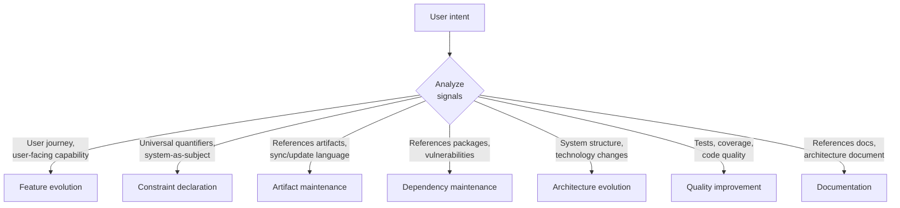
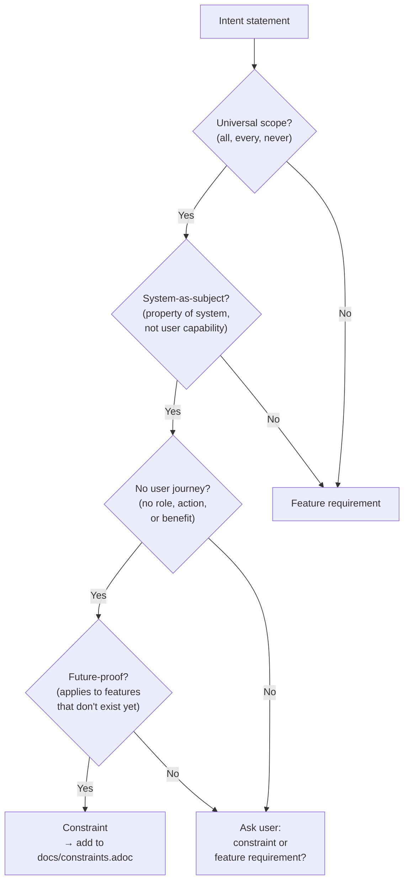
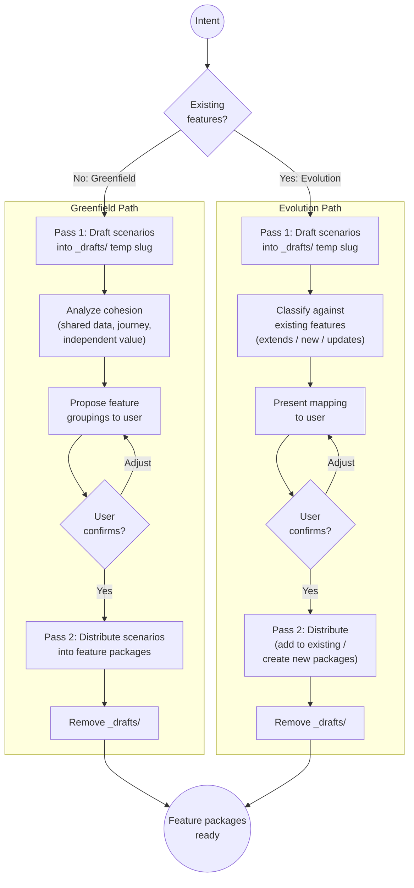
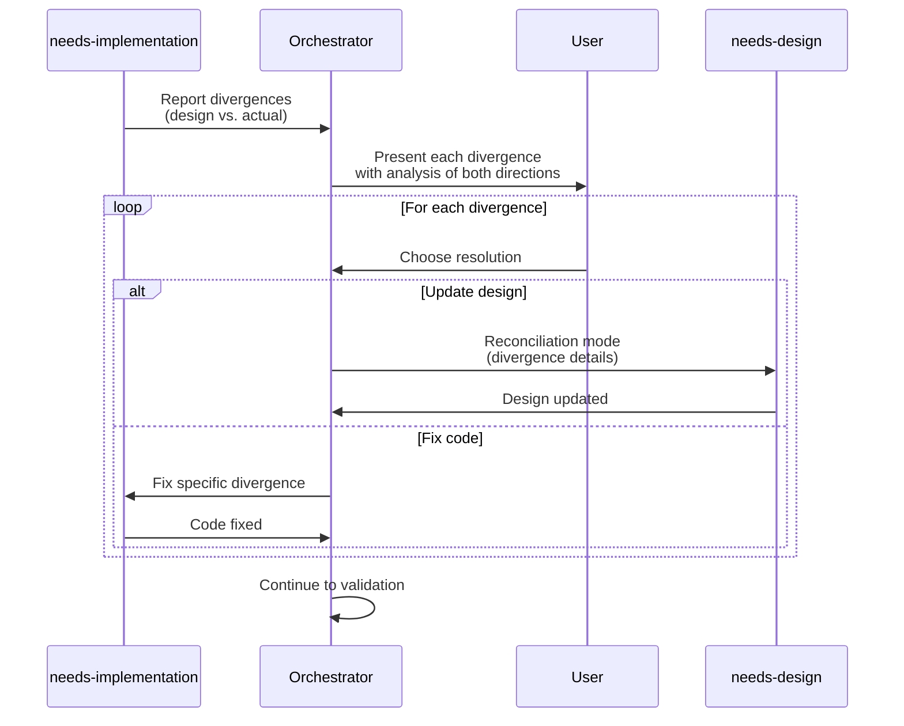
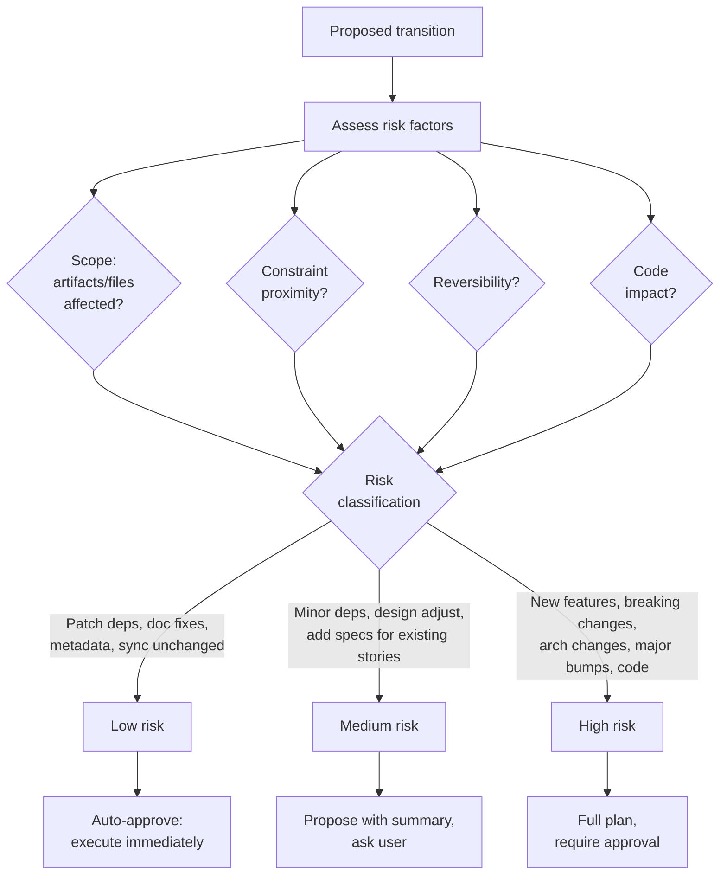
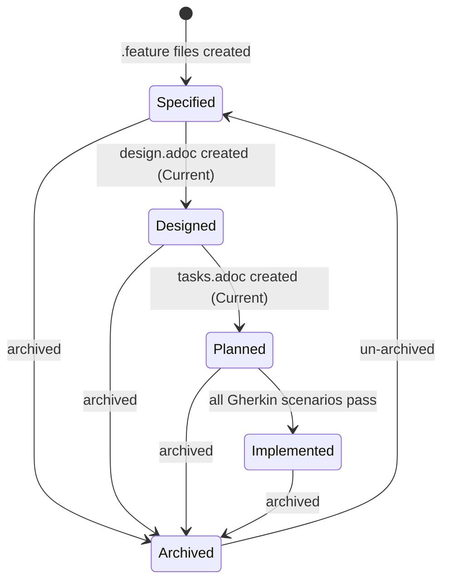
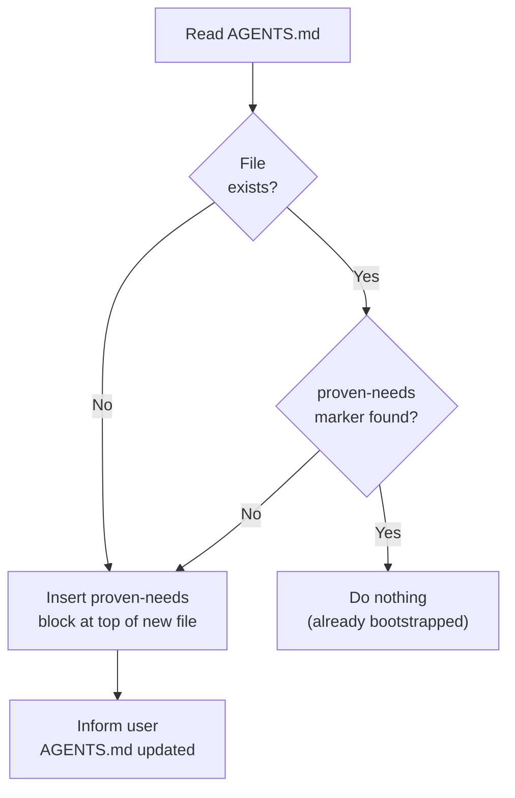

## Purpose

Continuously evolve a software system by declaring a desired state, evaluating it against the current state and constraints, then executing the minimal valid transition to make it true. Both maintenance and feature work are state changes, not task accumulation.

## State Transition Loop

```
Observe → Declare → Evaluate → Derive → Execute → Validate → Repeat
```

1. **Observe** -- capture the current state (automated)
2. **Declare** -- accept a desired state (from user or system-proposed)
3. **Evaluate** -- test feasibility against current state and constraints
4. **Derive** -- determine the minimal transition plan
5. **Execute** -- invoke capabilities to apply changes
6. **Validate** -- verify the desired state is now true
7. **Repeat** -- declare the next desired state

## Core Concepts

### Current State

The observable, verifiable reality of the system right now. Computed fresh each invocation, never stored.

**Artifact state:**
- Which feature packages exist in `docs/features/`
- For each feature: which artifacts exist (`.feature` files, design, tasks), their statuses
- Project-wide artifacts: `docs/constraints.adoc`, `docs/adrs/`, `docs/architecture.adoc`, `docs/state-log.adoc`
- Staleness: have `.feature` files changed since design was last updated? (detected via git)

**Codebase state:**
- Language, framework, project structure
- Dependency graph and versions (from package.json, Cargo.toml, go.mod, etc.)
- Test coverage and test status
- Lint and build status
- Security posture (known vulnerabilities in dependencies)

### Desired State

A declarative statement of what must be true after this transition. Desired states come from:
- The user (explicit intent)
- The system (detected conditions, proposed to user)

Examples:
- "Users can reset their password via SMS" (feature)
- "All dependencies have no known critical vulnerabilities" (maintenance)
- "The architecture document reflects the current system" (documentation)
- "All API endpoints enforce rate limiting" (constraint)

### Constraints (Invariants)

Rules that must not be violated across any transition. Defined in `docs/constraints.adoc`. See the Constraints section below for the full specification.

### Feature Package

A self-contained unit of work scoped to one feature. Lives in `docs/features/<slug>/`:

```
docs/features/<slug>/
├── *.feature            # WHY + WHAT + VERIFY: Gherkin scenarios (user stories, specs, and executable tests in one)
├── steps/               # Cucumber step definitions (glue code)
├── design.adoc          # HOW: implementation blueprint
└── tasks.adoc           # WORK: phased implementation breakdown
```

Gherkin `.feature` files replace the separate `user-stories.adoc`, `spec.adoc`, and test files. Each `.feature` file contains:
- A `Feature:` description with As a / I want / So that (the user story)
- `Scenario:` blocks with Given/When/Then (the specification and test)
- `@<PREFIX>-<NNN>` tags on each scenario (the spec requirement IDs)

Step definitions (glue code) live within the feature package at `docs/features/<slug>/steps/`.

Each feature package is fully independent -- it can be specified, designed, and implemented without reading other feature packages. Feature designs reference project-wide ADRs and architecture but never other feature designs.

### State Log

An append-only audit trail of all state transitions. Lives at `docs/state-log.adoc`. See the State Log section below for the format.

## Capabilities

The orchestrator does not produce artifacts directly. It invokes capabilities (the `needs-*` skills) to perform work. Each capability follows the observe/evaluate/execute pattern.

### Invoking a capability

To invoke a capability, **load its skill** (e.g., `needs-features`). Each capability is a separate skill with its own instructions for artifact format, quality checks, and the observe/evaluate/execute cycle.

**Do NOT attempt to perform a capability's work without first loading its skill.** The orchestrator's job is to plan and coordinate -- the capability skills contain the detailed instructions for producing correct artifacts.

Invocation steps:
1. Load the skill by name (e.g., `needs-features`, `needs-design`)
2. The capability skill will run its own observe -> evaluate -> execute cycle
3. Wait for the capability to complete and return its report before proceeding to the next capability
4. If a capability skill references another skill (e.g., `needs-design` may load `needs-adr`), that skill must also be loaded

### Feature-scoped capabilities

These operate within a single feature package:

| Capability | Skill | Domain |
|---|---|---|
| Features | `needs-features` | Create/update Gherkin feature files (stories + specs + tests in one) |
| Design | `needs-design` | Create implementation blueprint for a feature |
| Tasks | `needs-tasks` | Break design into phased implementation units |
| Implementation | `needs-implementation` | Write and verify code for a feature |

### Project-wide capabilities

These operate at the project level:

| Capability | Skill | Domain |
|---|---|---|
| ADRs | `needs-adr` | Record technology decisions |
| Architecture | `needs-architecture` | Document current system architecture |
| Dependencies | `needs-dependencies` | Manage and update dependency graph |
| Security | `needs-security` | Assess and remediate security posture |
| Compliance | `needs-compliance` | Verify license and policy compliance |

### Supporting skills

None. Gherkin's Given/When/Then syntax is the requirement language.

## Workflow

### 1. Observe Current State

When this skill is invoked, immediately build the current state model:

#### 1.1 Read project-wide artifacts

1. **`docs/constraints.adoc`** -- read all constraint categories and rules. If missing, note that no constraints are defined. Do not create it automatically -- the user declares constraints intentionally.

2. **`docs/features/`** -- list all feature directories. For each, check which artifacts exist (`.feature` files, `design.adoc`, `tasks.adoc`). Features with an `@archived` tag on the `Feature:` block are reported in the summary but skipped during intent classification and staleness checks.

3. **`docs/adrs/`** -- read the index, note how many ADRs exist and their statuses.

4. **`docs/architecture.adoc`** -- check existence, read `:version:` if present.

5. **`docs/state-log.adoc`** -- check existence, read recent transitions for context. Pay particular attention to:
   - **`:result: In Progress`** -- the prior session started a transition but ended unexpectedly (crash, context exhaustion, tool failure) without cleanly recording a result. The entry contains the intent and plan but `:capabilities-invoked:` may be empty or incomplete. Propose resuming the transition or marking it as `:result: Failed` before starting new work.
   - **`:result: Partial`** -- the user explicitly stopped a transition mid-way. The entry lists capabilities completed vs. remaining. Propose completing the remaining capabilities before starting new work.
   
   In both cases, the transition's `:features:` and `:capabilities-invoked:` fields provide useful context for understanding why artifacts are in their current state (e.g., stories and spec exist but design is missing because a prior transition was interrupted).

#### 1.2 Analyze codebase

1. **Project type** -- detect language, framework, build system from configuration files (package.json, Cargo.toml, go.mod, pyproject.toml, etc.)

2. **Dependencies** -- parse dependency files. Identify outdated packages, known vulnerabilities, archived/unmaintained packages, license information.

3. **Quality signals** -- check if build passes, linting passes, tests pass. Read test coverage if available.

4. **Code structure** -- understand directory layout, module organization, existing patterns.

#### 1.3 Present state summary

Present a concise summary to the user:

```
Current state:
  Features: 3 (user-auth [implemented], user-profile [designed], shopping-cart [specified])
  Constraints: 8 rules across 4 categories
  ADRs: 2 accepted
  Architecture: v1.0.0 (current)
  Codebase: TypeScript/Next.js, 47 deps (1 vulnerable), 78% coverage, build passing
  Staleness: user-profile .feature files changed since last design update
```

### 2. Accept Desired State

The user states what they want to be true. The orchestrator interprets this as a desired state.

#### 2.1 Intent classification

Classify the desired state into one or more intent types:

| Intent Type | Signals | Example |
|---|---|---|
| **Feature evolution** | Describes user-facing capability, has a user journey | "Users can reset password via SMS" |
| **Constraint declaration** | Universal quantifiers, system-as-subject, applies to features that don't exist yet | "All API endpoints must enforce rate limiting" |
| **Artifact maintenance** | References existing artifacts, sync/update language | "Specs are in sync with current stories" |
| **Dependency maintenance** | References packages, versions, vulnerabilities | "No dependencies have known vulnerabilities" |
| **Architecture evolution** | References system structure, technology changes | "Authentication uses OAuth2 instead of sessions" |
| **Quality improvement** | References tests, coverage, code quality | "All API endpoints have integration tests" |
| **Documentation** | References docs, architecture document | "Architecture doc reflects current system" |



#### 2.2 Constraint detection

Before proceeding with feature decomposition, check whether the intent is actually a constraint. An intent is a constraint if:

1. **Universal scope** -- it uses quantifiers like "all", "every", "no X may", "must always", "never"
2. **System-as-subject** -- it describes a property of the system, not a capability for a user
3. **No user journey** -- there is no identifiable user role, action, or benefit
4. **Future-proof** -- it would apply to features that don't exist yet



If the intent is a constraint:
- Propose adding it to `docs/constraints.adoc` with the appropriate category
- Ask the user to confirm
- If confirmed, update `docs/constraints.adoc` and record the transition in the state log
- Do not create a feature package

If uncertain, ask the user:
```
Your intent could be interpreted as:
  1. A project-wide constraint (enforced on all features, current and future)
  2. A feature-specific requirement (applies only to one feature)

Which did you mean?
```

#### 2.3 Feature decomposition (for feature evolution intents)



**When no features exist yet (greenfield):**

This uses a two-pass approach because `needs-features` operates within a feature package (requires a slug), but feature groupings aren't known until scenarios are drafted.

**Pass 1 -- Draft scenarios with a temporary slug:**

1. Invoke `needs-features` with a temporary working slug (e.g., `_drafts`) to derive Gherkin scenarios from the intent. This produces an initial set of `.feature` files without committing to a feature structure.
2. Analyze scenario cohesion to propose feature groupings:
   - Scenarios that share the same data entities → same feature
   - Scenarios in the same user journey → same feature
   - Scenarios that can deliver independent value → separate features
3. Present the proposed grouping to the user:
   ```
   Based on your intent, I propose 2 features:

   Feature 1: user-authentication
     - Login scenarios (@AUTH-001, @AUTH-002)
     - Registration scenarios (@AUTH-003, @AUTH-004)
     - Password Reset scenarios (@AUTH-005, @AUTH-006)
     (Share auth flow and user credentials)

   Feature 2: user-profile
     - View Profile scenarios (@PROF-001)
     - Edit Profile scenarios (@PROF-002, @PROF-003)
     (Independent of auth, operate on profile data)

   Adjust grouping?
   ```
4. Wait for user confirmation before creating feature packages.

**Pass 2 -- Distribute scenarios into feature packages:**

5. For each confirmed feature, invoke `needs-features` with the final slug to create the feature's `.feature` files, distributing the drafted scenarios into their assigned feature packages. Spec ID tags are reassigned to be sequential within each feature.
6. Remove the temporary `_drafts` directory if it was created on disk.

**When features already exist (evolution):**

This also uses a two-pass approach. Scenarios are drafted first, then classified against existing features.

**Pass 1 -- Draft scenarios and classify:**

1. Observe existing features and their scenarios.
2. Invoke `needs-features` with a temporary working slug (e.g., `_drafts`) to derive scenarios from the new intent.
3. Classify each drafted scenario against existing features:
   - **Extends existing:** Scenario shares data/state/journey with an existing feature → propose adding to that feature
   - **New feature:** Scenario doesn't fit any existing feature → propose new feature package
   - **Updates existing:** Scenario modifies behavior already covered by an existing feature → propose updating that feature
4. Classification heuristics:
   - Match scenario keywords against existing feature `.feature` files
   - Check if the scenario's data entities overlap with an existing feature
   - Check if the scenario belongs to the same user journey as an existing feature
5. Present the mapping to the user for confirmation:
   ```
   This intent maps to:

   Extend: user-authentication/ (existing)
     - Add scenarios: SMS Password Reset (@AUTH-007, @AUTH-008)
     - Design will need updating for SMS flow

   Create: notification-preferences/ (new)
     - Manage Notification Channels scenarios
     - Set Notification Preferences scenarios

   Confirm or adjust?
   ```

**Pass 2 -- Distribute scenarios:**

6. For scenarios assigned to existing features, invoke `needs-features` (add mode) for each feature with the relevant scenarios.
7. For scenarios assigned to new features, invoke `needs-features` (create mode) for each new feature.
8. Remove the temporary `_drafts` directory if it was created on disk.

**Constraint surfacing during decomposition:**

While deriving scenarios, if a requirement is identified as cross-cutting:
1. Flag it as a potential constraint
2. Present to the user:
   ```
   While writing scenarios for user-authentication, I found a cross-cutting requirement:
     "Passwords must be at least 8 characters with mixed case and numbers"

   This applies to registration, password reset, and any future password feature.

   Options:
     1. Add to docs/constraints.adoc (recommended -- enforced everywhere)
     2. Keep as feature scenario (only enforced in this feature)
   ```

### 3. Evaluate Feasibility

For each feature in the transition plan, check:

#### 3.1 Precondition check

Does the desired state require artifacts that don't exist yet? For each involved capability:
- `needs-design` requires `.feature` files → do they exist?
- `needs-tasks` works best with design → is design available?
- `needs-implementation` requires `.feature` files (for acceptance scenarios) and at minimum a design → do they exist?

If preconditions are unmet, the orchestrator can satisfy them as part of the transition (by invoking earlier capabilities first). This is not a pipeline -- the orchestrator dynamically determines what's needed.

#### 3.2 Constraint check

Test the proposed transition against all constraints in `docs/constraints.adoc`:
- Would any constraint be violated by the proposed changes?
- Are there existing constraint violations that should be resolved first?

If a constraint would be violated:
```
Constraint violation detected:

  Architecture constraint: "Business logic resides in the service layer"
  Proposed design places validation logic in route handlers.

Options:
  1. Revise the design to satisfy the constraint
  2. Update the constraint (requires justification)
  3. Abort this transition
```

#### 3.3 Staleness check

Check if any existing artifacts involved in the transition are stale (using git history):
- `.feature` files changed but design not refreshed?
- Feature implemented but architecture not updated?

Report staleness and recommend resolution before proceeding.

### 4. Derive Transition Plan

Build a dependency graph of capability invocations. The graph is derived, not hardcoded.

**For each feature in scope:**

1. Determine which artifacts need creating or updating
2. Order capabilities by dependency: features → design → tasks → implementation. `needs-features` is always invoked -- every feature gets Gherkin scenarios. Feature files are the contract between intent (WHY) and design (HOW), and they serve as the executable acceptance gate for implementation.
3. Skip capabilities whose artifacts are already current and satisfy the desired state (e.g., `.feature` files already exist and cover the intent)
4. Mark which steps can run in parallel across features (independent features can be processed concurrently)

**Architecture updates:**

After all feature implementations in the current transition are complete, invoke `needs-architecture` if:
- Any feature implementation changed the system's component structure (new services, new data stores, new external interfaces)
- The architecture document doesn't exist yet
- The architecture document is stale relative to the implemented features

Do not invoke `needs-architecture` mid-transition between features -- wait until all features are implemented so the architecture document reflects the complete system state.

**Present the plan to the user:**

```
Transition plan to achieve "Users can reset password via SMS":

  Feature: user-authentication/ (extend existing)
  1. needs-features: Add SMS password reset scenarios to .feature files
  2. needs-design: Update design for SMS flow
  3. needs-tasks: Create implementation tasks
  4. needs-implementation: Implement code + step definitions (scenarios must pass)

  Skipping: needs-adr (no new technology decisions)
  Post-implementation: needs-architecture (update after implementation)

  Risk: HIGH (new feature behavior, code changes)
  Estimated artifacts affected: .feature files + step definitions + code

  Proceed?
```

#### Execution mode

After the user approves the transition plan, ask how they want the workflow to execute:

```
How should I proceed through the capabilities?

  1. Autonomous -- execute all capabilities without pausing between them
  2. Interactive -- ask for confirmation before starting each capability
```

Store the user's choice for the duration of this transition. Default to **Interactive** if the user does not express a preference.

### 5. Execute Transition

**Before invoking the first capability**, append an `In Progress` entry to `docs/state-log.adoc` with the fields known so far: `:date:`, `:intent:`, `:type:`, `:risk:`, `:features:`, `:desired-state:`, `:prior-state:`, and `:result: In Progress`. Leave `:capabilities-invoked:`, `:constraints-checked:`, and `:artifacts-modified:` empty -- these are filled in when the transition completes or is stopped. This ensures that if the session ends unexpectedly, a recoverable trace exists.

Invoke capabilities in the derived order by loading each capability skill. For each capability:

1. The orchestrator passes the feature context (slug, desired state, current state for that feature)
2. The capability runs its observe → evaluate → execute cycle
3. The orchestrator validates the capability's output before proceeding to the next

**Between capabilities:**
- Verify the artifact was created/updated correctly
- Check that no constraints were violated
- Update the state model

### Transition progress tracking

Maintain an explicit checklist of all capabilities to invoke for this transition. Use the todo-list tool if available. After each capability completes, mark it done.

**Execution mode behavior:**
- **Interactive mode:** After each capability completes, present the updated checklist and ask the user whether to continue to the next capability. Show which capabilities are done, which is next, and which remain.
- **Autonomous mode:** After each capability completes, immediately proceed to the next capability without asking. Report progress inline (e.g., "needs-features complete, proceeding to needs-design...").

In both modes, the following rules apply:
- **Do NOT skip capabilities in the plan.** Every capability in the derived transition plan must be invoked unless the user explicitly asks to stop.
- **Do NOT treat `needs-implementation` as the final step.** Post-implementation capabilities (`needs-architecture`, design divergence resolution) are part of the plan and must execute. Note: Gherkin scenarios are written *before* implementation -- they are the acceptance gate, not a post-implementation step.
- If the user asks to stop mid-transition, update the existing `In Progress` entry in `docs/state-log.adoc`: set `:result: Partial`, fill in `:capabilities-invoked:` with capabilities completed so far, and add `:capabilities-remaining:` listing what was not yet invoked.
- When a new session starts, the Observe phase (step 1) reads the state-log for `:result: Partial` or `:result: In Progress` entries. Either indicates incomplete work -- propose completing it before starting new work.

**Design divergence resolution (after `needs-implementation` completes):**



When `needs-implementation` finishes, it reports any divergences between the design and what was actually built. For each divergence, it provides:
- What the design specified vs. what was implemented
- Analysis of both resolution directions: (a) update the design to match implementation, (b) fix the code to match the design
- Rationale for why the implementation diverged (practical constraints, better approach discovered, etc.)

Present this analysis to the user with enough context to make a good decision. For each divergence:
- If the user chooses "update design" → invoke `needs-design` (reconciliation mode) with the divergence details
- If the user chooses "fix code" → re-invoke `needs-implementation` with the specific fix
- The user may choose different resolutions for different divergences

**Divergence report verification:**
After `needs-implementation` completes, verify that it produced a divergence report. If no report was provided (neither divergences nor an explicit "no divergences" confirmation), request the report before proceeding to post-implementation steps.

**Error handling:**
- If a capability fails validation → stop, report to user, ask how to proceed
- If a constraint is violated during execution → stop, report, offer to revise or abort
- If the user wants to stop mid-transition → save progress, update the `In Progress` entry to `:result: Partial` in state log

### 6. Validate

After all capabilities in the transition have executed:

1. Re-observe the current state
2. Compare against the original desired state
3. Verify all constraints still hold
4. Run verification commands (build, test, lint) if code was changed

**If desired state achieved:**
- Update the existing `In Progress` entry in `docs/state-log.adoc`: set `:result: Achieved`, fill in `:capabilities-invoked:`, `:constraints-checked:`, and `:artifacts-modified:`
- Report success to user

**If desired state NOT achieved:**
- Identify what's missing
- Propose additional steps or report what went wrong
- Do not update the entry to `:result: Achieved` -- leave as `In Progress` until resolved, or set to `:result: Failed` if unrecoverable

### 7. Record Transition

Update the existing `In Progress` entry in `docs/state-log.adoc` with the final result. The entry was created at the start of Step 5 -- now fill in `:capabilities-invoked:`, `:constraints-checked:`, `:artifacts-modified:`, and set `:result:` to `Achieved`, `Partial`, or `Failed`. See the State Log section for format.

## Risk Classification and Auto-Approve



Transitions are classified by risk level:

| Risk Level | Auto-approve? | Criteria |
|---|---|---|
| **Low** | Yes, execute immediately | Patch dependency updates; sync specs with unchanged story semantics; format/metadata fixes; documentation updates |
| **Medium** | Propose with summary, ask | Minor dependency updates; design adjustments for modified stories; adding specs for existing stories |
| **High** | Full plan, require approval | New features; breaking changes; architecture changes; major version bumps; constraint modifications; code changes |

**Risk factors:**
- Scope: How many artifacts/files are affected?
- Constraint proximity: Does the change approach any constraint boundary?
- Reversibility: Can the change be undone?
- Code impact: Does it modify production code?

**System-proposed intents:**

The orchestrator can detect conditions and propose desired states:
- "Dependency X has a critical CVE -- desired state: X is patched" (auto-approve if patch-level)
- "Feature user-auth specs are stale relative to stories" (propose sync, medium risk)
- "3 features share the same password validation requirement" (propose as constraint, high risk)

For auto-approved transitions, inform the user after execution:
```
Auto-approved: Updated lodash 4.17.20 → 4.17.21 (CVE-XXXX patched). Tests passing.
```

## Constraints Specification

### File location and format

`docs/constraints.adoc`:

```asciidoc
= Project Constraints
:version: 1.0.0
:last-updated: YYYY-MM-DD

== Security

* Passwords must be at least 8 characters with mixed case and numbers.
* All user sessions must expire after 24 hours of inactivity.
* No dependency with a known CRITICAL or HIGH CVE may remain unpatched for more than 7 days.
* All user input must be validated before processing.

== Licensing

* Only MIT, Apache-2.0, and BSD-licensed dependencies are permitted.

== API Compatibility

* Public endpoints maintain backward compatibility within a MAJOR version.
* Removal of any public endpoint requires a MAJOR version bump.

== Architecture

* Business logic resides in the service layer, not in route handlers.
* No direct database access from UI components.

== Quality

* Test coverage must not decrease per feature implementation.
* All code passes linting and type checking.

== Performance

* API P95 response time must remain below 200ms.
```

### Constraint lifecycle

- **Adding:** User declares intent that is classified as constraint, or constraint is surfaced during spec derivation. Always requires user confirmation. MINOR version bump.
- **Modifying:** User explicitly requests relaxing or tightening a rule. Requires user confirmation. MINOR or MAJOR bump depending on impact.
- **Removing:** User explicitly requests removal. Requires confirmation with warning about enforcement loss. MAJOR version bump.

Constraints are intentionally stable. Frequent constraint changes indicate they may be too specific (should be feature specs) or too vague (need refinement).

### Constraint enforcement

Every capability checks relevant constraints during its Evaluate phase:
- `needs-features`: checks quality constraints (testability, completeness) and that scenarios do not duplicate project-wide constraints
- `needs-design`: checks architecture constraints
- `needs-tasks`: checks quality constraints (testing tasks exist if coverage constraints apply)
- `needs-implementation`: checks quality, performance, architecture constraints
- `needs-dependencies`: checks licensing, security constraints
- `needs-security`: checks security constraints
- `needs-compliance`: checks licensing constraints

A constraint violation blocks a transition unless the user explicitly chooses to update the constraint.

## State Log Specification

### File location and format

`docs/state-log.adoc`:

```asciidoc
= State Transition Log
:last-updated: YYYY-MM-DD

== TRANSITION-003
:date: 2026-02-23
:intent: Users can reset their password via SMS
:type: Feature evolution
:risk: High
:features: user-authentication (extended)
:desired-state: SMS password reset is available alongside email reset
:prior-state: user-authentication has email reset only (implemented)
:capabilities-invoked: needs-features, needs-design, needs-tasks, needs-implementation
:constraints-checked: Security (pass), Architecture (pass), Quality (pass)
:result: Achieved
:artifacts-modified: docs/features/user-authentication/password-reset.feature, docs/features/user-authentication/design.adoc (v2.0.0), docs/features/user-authentication/tasks.adoc (v1.0.0), docs/features/user-authentication/steps/password-reset.steps.js

== TRANSITION-002
:date: 2026-02-22
:intent: No dependencies have known vulnerabilities
:type: Dependency maintenance
:risk: Low (auto-approved)
:features: n/a (project-wide)
:desired-state: Zero known vulnerabilities in dependency graph
:prior-state: lodash@4.17.20 has HIGH CVE
:capabilities-invoked: needs-dependencies
:constraints-checked: Security (triggered), Licensing (pass)
:result: Achieved
:artifacts-modified: package.json, package-lock.json

== TRANSITION-001
...
```

### State log conventions

- Transitions are numbered sequentially (TRANSITION-001, TRANSITION-002, ...)
- Newest transitions appear first (reverse chronological)
- Entries are created at the start of execution with `:result: In Progress`, then updated exactly once with the final result when the transition completes or is stopped
- `:result:` values:
  - `In Progress` -- transition is actively executing, or the prior session ended unexpectedly before recording a final result. On session start, the Observe phase detects these and proposes resuming or marking as Failed.
  - `Achieved` -- desired state was reached and validated
  - `Partial` -- user explicitly stopped the transition mid-way. `:capabilities-invoked:` lists what completed; `:capabilities-remaining:` lists what was not yet invoked.
  - `Failed` -- transition failed with a reason

## Feature Package Conventions

### Slug naming

Feature directory names use kebab-case derived from the feature's primary purpose:
- `user-authentication`
- `password-reset-sms`
- `shopping-cart`
- `notification-preferences`

Slugs are stable -- do not rename feature directories after creation. If a feature's scope changes significantly, create a new feature and archive the old one.

### Feature status

A feature's status is derived from which artifacts exist and their states:



| Artifacts Present | Derived Status |
|---|---|
| `.feature` files only | `Specified` |
| + design.adoc (status: Current) | `Designed` |
| + tasks.adoc (status: Current) | `Planned` |
| All Gherkin scenarios pass, implementation complete | `Implemented` |
| `@archived` tag on Feature blocks | `Archived` |

**Task cleanup:** Once a feature reaches `Implemented` (all Gherkin scenarios pass), `tasks.adoc` is no longer needed as the completion oracle -- passing scenarios serve that role. The task file may be removed or left in place at the team's discretion. If removed, the feature remains `Implemented` as long as scenarios continue to pass.

### Feature archival

A feature is archived when its scope has fundamentally changed (superseded by a new feature), or when it is no longer relevant to the system. Archival is intentional and explicit:

1. Add `@archived` tag to all `Feature:` blocks in the feature's `.feature` files
2. Record the archival in the state log

**Archived features:**
- Are skipped during intent classification (the Observe phase reports them but does not match new intents to them)
- Are not included in staleness checks
- Remain on disk as historical records (never deleted)
- Can be un-archived by removing the `@archived` tag if the feature becomes relevant again

### Artifact versioning

Feature files (`.feature`) do not carry explicit version numbers. Staleness and change detection use git history:
- `git log` on `.feature` files shows when scenarios last changed
- `git diff` between `.feature` files and `design.adoc` last-modified dates detects staleness
- Design and tasks still use AsciiDoc with `:version:` and `:last-updated:` attributes

Design tracks its upstream via git:
- When `needs-design` runs, it checks whether `.feature` files have changed since `design.adoc` was last modified
- If yes, the design is stale and needs updating

### Format and dates

Feature specifications use Gherkin (`.feature` files). Design and task artifacts use AsciiDoc (`.adoc`). Dates use `YYYY-MM-DD` format. Diagrams use Mermaid. AsciiDoc artifacts use `[source,mermaid]` blocks; these render as syntax-highlighted code on GitHub and as diagrams in Asciidoctor-compatible viewers with the `asciidoctor-diagram` extension.

### Diagram conventions

All generated documentation artifacts use Mermaid for diagrams and visual flows. When a capability produces documentation that includes architecture, component interactions, data flows, or process sequences, it embeds Mermaid diagram blocks in the AsciiDoc output.

**Architecture documentation** uses the C4 model via Mermaid's C4 diagram types. The orchestrator decides which levels to include based on project complexity:

| C4 Level | Diagram Type | When to Include |
|---|---|---|
| **Level 1: System Context** | `C4Context` | Always. Shows the system, its users, and external systems. |
| **Level 2: Container** | `C4Container` | Always. Shows major runtime containers (apps, databases, queues). |
| **Level 3: Component** | `C4Component` | When a container has significant internal structure (e.g., service layer with multiple modules). |
| **Level 4: Deployment** | `C4Deployment` | When the project has non-trivial deployment topology (e.g., multi-region, Kubernetes, CDN). |

Guidelines for adaptive inclusion:
- **Libraries, CLIs, simple projects:** L1 + L2 only.
- **Web applications with separate frontend/backend:** L1 + L2 + L3 for the backend container.
- **Microservices or distributed systems:** L1 + L2 + L3 + L4.

**Feature design documentation** uses Mermaid for:
- **Component interaction diagrams** (`flowchart`) -- how components relate and communicate
- **Sequence diagrams** (`sequenceDiagram`) -- key user flows and system interactions
- **State diagrams** (`stateDiagram-v2`) -- entities with meaningful state transitions
- **Data flow diagrams** (`flowchart`) -- how data moves through the system

Feature designs include at minimum one component interaction or sequence diagram for the primary flow. Additional diagrams are added when they clarify complex interactions that prose alone cannot convey efficiently.

### Requirement syntax

All behavioral specifications use Gherkin's Given/When/Then syntax. Each scenario is simultaneously a requirement, an acceptance criterion, and an executable test.

### Black-box constraint

Feature scenarios (`.feature` files) describe only externally observable behavior. Given/When/Then steps must not reference internal architecture, database schemas, API paths, or implementation details. Internal details belong in step definitions (glue code), the feature design document, project-wide architecture, and ADRs.

## Bootstrap

When this skill is loaded, **immediately** check the project's `AGENTS.md` for the proven-needs workflow marker.



### Steps

1. Read `AGENTS.md` in the project root (it may not exist yet).
2. Search for the marker `<!-- proven-needs:start -->`.
3. **If the marker is found** -- do nothing, the project is already bootstrapped.
4. **If the marker is NOT found** -- insert the new block at the very top of the file (or create the file with the block if it does not exist).

```markdown
<!-- proven-needs:start -->
## Development Workflow (Required)
All changes to this project **must** follow the proven-needs state transition workflow.
Before making any changes, **load the `proven-needs` skill**. Do not modify code, documentation,
or project artifacts without first going through the workflow it defines.
<!-- proven-needs:end -->
```

5. Inform the user that `AGENTS.md` was updated.

### Rules

- This check runs **every time** the skill is loaded, but is idempotent.
- Insert at the **top** of the file so the workflow requirement is the first thing agents see.
- Do NOT modify content between the markers if the block already exists.
- Perform this check **before** proceeding with any other workflow task.
